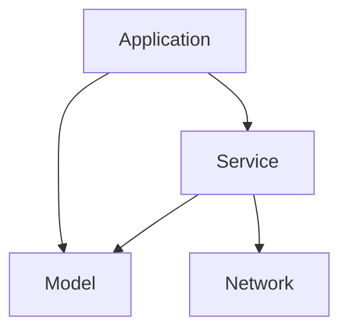

# Photo Search Application

PhotoSearch is a simple application that allows the user to search for any photo on Flickr. It does not require the user to be authenticated to preform searches. The user can then view selected images in a larger size by just tapping on the smaller image in the search result collection. The app requests images in batches of 20 to minimize network traffic in case the user does not view all the results. More images are fetched as the user starts scrolling down. 

## Installation steps
- Clone the repo localy or download the zip file
- Navigate to the folder using terminal and run `pod install`
- Open up the `PhotoSearch.xcworkspace` and run the PhotoSearch target

## Architecture

The application is built using MVC but all the layers are separated into their own dynamic libraries. This ensures that only the needed methods and classes are exposed to the public while keeping all the details encapsulated in the respective layer. I have also created a Network layer and a Service layer along with factories to create instances. Both the Network and the Service layer make certain protocol public while specific services implemented them within the layer. 

## Libraries used
- Alamofire - used to make network requests without writing large amounts of code. 
- Hero - used for the transition between the collection view and the large image view to provide a fluid user experience. 
- SDWebImage - Used to fetch images asynchronously with a benefit of caching. 

## Future Improvements 

- Do a performance optimization to fetch a lower resolution image to display in the collection view and fetch a high quality one when the user taps on it without compromising the fluidity. 
- Introduce authentication and allow the user to favorite photos they like. 
- A share feature that allows the user to share the photo on a social media platform of their choice. 

